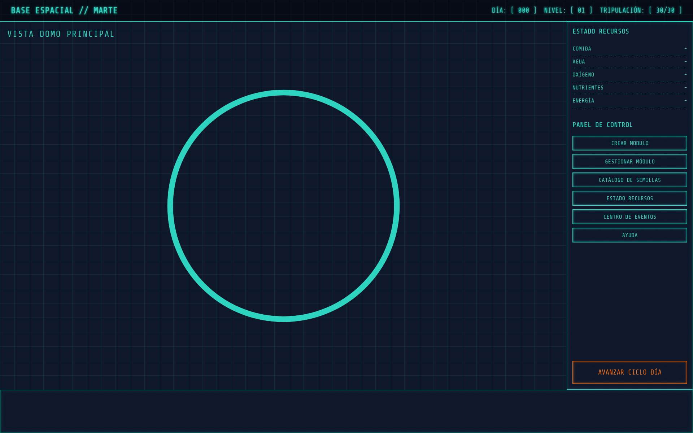
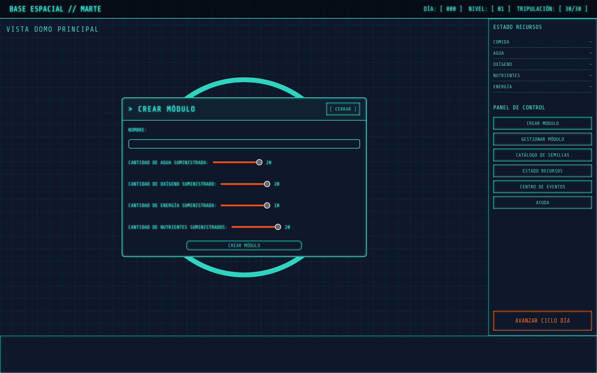
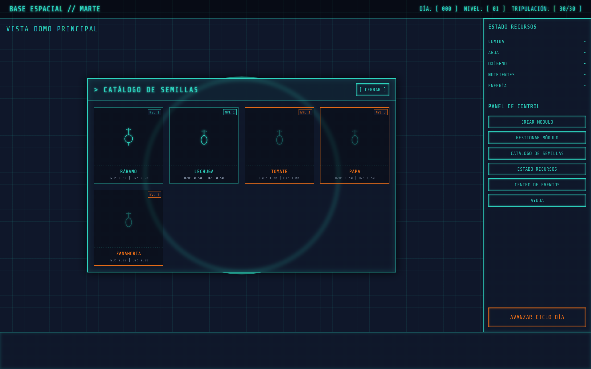
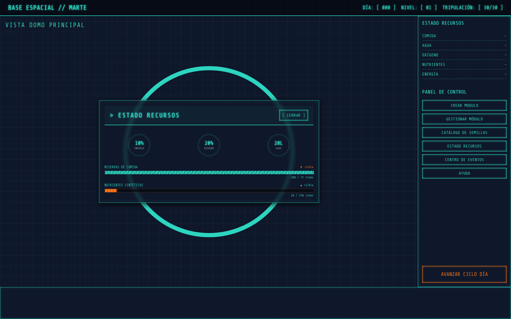
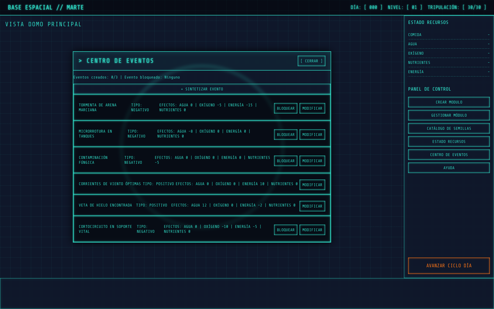

Proyecto invernadero.

### La historia
Una colonia de investigadores trabajaba en Marte cuando llegó la noticia: el cohete de suministros fue impactado por un meteorito y no llegará al planeta rojo. La próxima entrega tardará 6 meses. Los tripulantes tienen reservas para apenas un mes.

Un astronauta e ingeniero agropecuario toma la iniciativa: construir una huerta hidropónica dentro de la base para mantener viva a la colonia hasta que lleguen los refuerzos.

### Objetivo
Sobrevivir 180 días administrando los recursos de la base espacial. El jugador empieza con recursos limitados y debe gestionarlos estratégicamente para mantener vivos a los 30 tripulantes.

Si la comida se agota o el oxígeno falla, la misión termina en derrota.

### Cómo se juega
-Recursos
La base cuenta con 5 recursos principales:
Agua — necesaria para las plantas y los tripulantes
Oxígeno — vital para la supervivencia de la tripulación
Energía — alimenta los módulos de cultivo
Nutrientes — necesarios para el crecimiento de las plantas
Comida — se consume diariamente. Si llega a 0, los tripulantes empiezan a morir

### Módulos de cultivo
Los módulos son los invernaderos donde crecen las plantas. Para crearlos gastás recursos de la base. Cada módulo tiene nivel, capacidad de bloques y estado. Si no los mantenés, entran en estado crítico y las plantas mueren

### Plantas
Cada planta consume recursos diariamente y produce comida y oxígeno. Cuando llega su tiempo de cosecha, podés cosecharla para obtener agua y comida extra. Hay 5 especies disponibles, cada una con distintos requerimientos y recompensas, que se desbloquean según tu nivel.

### Avanzar el día
Cada vez que avanzás un día ocurre lo siguiente:
Las plantas consumen recursos de sus módulos
Los tripulantes consumen comida, agua y oxígeno
Puede ocurrir un evento aleatorio (tormenta de arena, fuga de tanques, etc.)
Si las plantas tienen suficientes recursos, crecen y eventualmente están listas para cosechar

### Eventos aleatorios
Marte es hostil. Cada día hay una probabilidad de que ocurra un evento que afecte los recursos de la base. Algunos son negativos (tormentas, fugas, plagas) y otros positivos (vientos óptimos, hielo subterráneo). Podés bloquear eventos negativos, modificar sus efectos o incluso crear tus propios eventos gastando recursos.

### Sistema de niveles
Cada 10 cosechas subís de nivel. Al subir de nivel recibís recursos adicionales y se desbloquean nuevas especies de plantas.

### Condiciones
Victoria: llegar al día 180 con al menos un tripulante vivo
Derrota: que todos los tripulantes mueran por falta de comida u oxígeno

## Capturas de pantalla

### Panel principal

### Crear módulo

### Catálogo de semillas

### Estado de recursos

### Centro de eventos

### Cómo levantar el proyecto
Requisitos
Docker instalado

Pasos
Clonar el repositorio

git clone git@github.com:matiasdiaz912/TP---Invernadero.git
cd TP---Invernadero

Levantar con Docker Compose

docker compose up --build

Esto levanta automáticamente la base de datos, el backend y el frontend.

Abrir el juego

Ingresar a http://localhost:8080 en el navegador.

Detener el proyecto

docker compose down

Reiniciar desde cero

docker compose down -v
docker compose up --build

### Tecnologías
Frontend: HTML5, CSS3 y JavaScript Vanilla con fetch (CSR)
Backend: Node.js con Express
Base de datos: PostgreSQL
DevOps: Docker y Docker Compose

Autores
Santiago Buldorini
Matias Díaz
Lisandro Lucero
